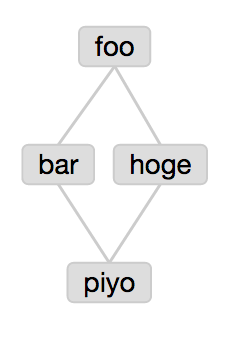

# ayd

ayd generates Azkaban Flow based on Azkaban YAML DSL.

##Prerequisites
Python 2.7

##Required Python Libraries
* cliff
* PyYAML

##Install
```
pip install ayd
```

Usage
----------

* aaa.yaml

```
foo:
  type: command
  command: echo "foo"
  retries: 1
  retry.backoff: 300000

bar:
  type: command
  command: echo "bar"
  dependencies: foo
  retries: 1
  retry.backoff: 300000

hoge:
  type: command
  dependencies: foo
  command: echo "hoge"
  command.1: echo "hoge1"
  retries: 2
  retry.backoff: 30000

piyo:
  type: command
  dependencies: bar, hoge
  command: echo "piyo"
  retries: 1
  retry.backoff: 300000
```

* execute
```
ayd generateFlow --flowyaml aaa.yaml --outputdir aaa
```

then, Azkaban Flow is generated.

If you archive aaa directory and upload aaa.zip, Azkaban Flow is the following.


